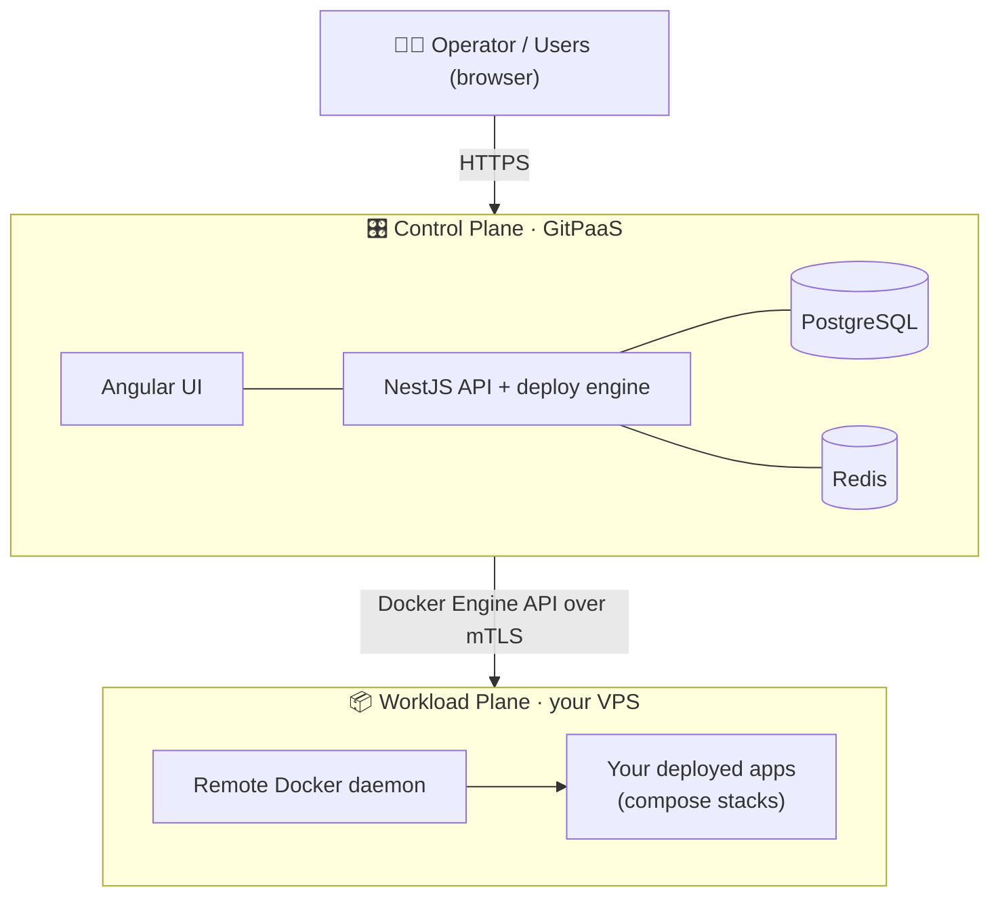

<div align="center">

# 🚀 GitPaaS

### Your apps. Your servers. Your platform.

**GitPaaS is an open, self-hostable PaaS** — install it on your own VPS and deploy applications straight from git, the way you would with Vercel, Dokploy, or Coolify. Except here, *you* own the infrastructure end to end.

<br />

[](https://nestjs.com/)
[](https://angular.dev/)
[](https://www.typescriptlang.org/)
[](https://www.postgresql.org/)
[](https://redis.io/)
[](https://www.docker.com/)
[](https://turbo.build/)
[](https://pnpm.io/)

[](https://github.com/orgs/gitopslovers/packages)
[](https://www.conventionalcommits.org/)
[](./CONTRIBUTING.md)
[](./docs/deployment-roadmap.md)

</div>

---

## 🌟 What is GitPaaS?

Point GitPaaS at a git repository and it does the rest: it clones the repo at a specific commit, builds or pulls the images, and runs the resulting `docker-compose` stack on a Docker host you control — with a durable deployment queue and **live log streaming** to your browser.

There is no managed cloud in the middle. The platform and the apps it runs both live on *your* servers. You get the convenience of a modern PaaS with the control and privacy of self-hosting.

> 💡 **In one line:** GitPaaS is the control panel; your VPS is the runway.

---

## ✨ Features

|    | Feature                      | What it means for you                                                                                                             |
|----|------------------------------|-----------------------------------------------------------------------------------------------------------------------------------|
| 🔀 | **Git-based deploys**        | Deploy any repo at a resolved commit — builds the `build:` services, pulls the rest, and brings the compose stack up.             |
| 📬 | **Durable deployment queue** | DB-backed, at-least-once queue with bounded retries, dead-lettering, and restart recovery. In-flight work survives a restart.     |
| 📡 | **Live log streaming**       | Deployment output streams to the browser over Server-Sent Events *and* is persisted, so history is replayable after the run ends. |
| 🔐 | **Remote Docker over mTLS**  | The control plane drives a remote Docker daemon over mutually-authenticated TLS — the same runtime model as Coolify and Dokploy.  |
| 🏠 | **Own your infrastructure**  | Self-hosted by design. Your code, your data, your servers — no third-party platform in between.                                   |
| 🐙 | **GitHub App integration**   | Browse repositories and branches, resolve commits, and pull archives through a GitHub App.                                        |
| 🛡️ | **Built-in authentication**  | JWT with Passport, refresh-token rotation, and argon2 password hashing.                                                           |
| 🩺 | **Operational tooling**      | Readiness probes for PostgreSQL, Redis, and Docker, plus image/volume/container pruning and read-only inspection.                 |

---

## 🧭 How it works

GitPaaS splits cleanly into **two planes** — and keeping them separate is the core idea of the whole design.

- **🎛️ Control plane** — GitPaaS *itself*: a NestJS API + deploy engine, an Angular web UI, plus its own **PostgreSQL** (durable state) and **Redis** (live log buffer + pub/sub). This is what you install and log into.
- **📦 Workload plane** — a **remote Docker host** where your deployed apps actually run. The control plane never runs your workloads in its own containers; it reaches out to a Docker daemon over the network via **mTLS** and brings your compose stacks up there.



A single deployment is one self-contained unit of work — *"bring this service's compose stack up on the VPS"* — orchestrated end to end by the control plane, streamed live, and recorded for replay.

📖 Dive deeper in the [Infrastructure Architecture](./docs/infrastructure-architecture.md).

---

## 🛠️ Tech stack

GitPaaS is a **Turborepo + pnpm** monorepo with two apps under `apps/`:

| Area                              | Stack                                                                    |
|-----------------------------------|--------------------------------------------------------------------------|
| 🧩 **Backend** (`apps/backend`)   | NestJS v11 REST API + deploy engine, hexagonal architecture, TypeORM     |
| 🎨 **Frontend** (`apps/frontend`) | Angular v22 SPA, Tailwind CSS, Signals                                   |
| 🗄️ **Data**                       | PostgreSQL (durable state) · Redis (live logs & pub/sub)                 |
| 📦 **Runtime**                    | Docker (remote daemon over mTLS)                                         |
| 🧰 **Tooling**                    | TypeScript · Turborepo · pnpm · Node 26.1.0 (pinned in `.tool-versions`) |

---

## 🚀 Getting started

> ℹ️ This is a quick developer preview. For the full contributor setup (environment variables, the emulated-VPS dev stack, and more), see **[CONTRIBUTING.md](./CONTRIBUTING.md)**.

### Prerequisites

- **Node** `26.1.0` and **pnpm** `11.1.3` (see [`.tool-versions`](./.tool-versions))
- **Docker** running on your host

### Install & run

```bash
# 1. Install dependencies
pnpm install

# 2. Bring up the local dev dependencies (Postgres, Redis, and an emulated VPS)
#    from iac/development/ — see CONTRIBUTING.md for details

# 3. Start the backend + frontend in dev mode (Turborepo)
pnpm dev
```

Handy root scripts (all powered by Turborepo):

| Script             | What it does                         |
|--------------------|--------------------------------------|
| `pnpm dev`         | Run backend + frontend in watch mode |
| `pnpm build`       | Build every app                      |
| `pnpm test`        | Run the test suites                  |
| `pnpm lint`        | Lint the workspace                   |
| `pnpm check-types` | Type-check the workspace             |

### 📦 Released images

Tagged releases publish **public, multi-arch** (`amd64` + `arm64`) container images to the GitHub Container Registry:

```
ghcr.io/gitopslovers/gitpaas-backend:{version|latest}
ghcr.io/gitopslovers/gitpaas-frontend:{version|latest}
```

---

## 📚 Documentation

| Doc                                                                     | What's inside                                                    |
|-------------------------------------------------------------------------|------------------------------------------------------------------|
| 🧩 [Backend Architecture](./docs/backend-architecture.md)               | The NestJS API's hexagonal layout, ports & adapters, persistence |
| 💼 [Backend Business](./docs/backend-business.md)                       | The domain workflows behind the deploy engine                    |
| 🎨 [Frontend Architecture](./docs/frontend-architecture.md)             | The Angular SPA's feature folders, layering, and conventions     |
| 🏗️ [Infrastructure Architecture](./docs/infrastructure-architecture.md) | The two-plane model, dev vs. production, and image publishing    |
| 🗺️ [Deployment Roadmap](./docs/deployment-roadmap.md)                   | The product vision and the phased path to a full PaaS            |

---

## 🗺️ Roadmap

GitPaaS today is a **working single-tenant deploy engine** — git → build → compose-up on a remote Docker host, with a durable queue and live logs. It's honestly **a work in progress**, actively evolving toward the full self-host PaaS vision.

The phased plan (each phase unlocks the next):

1. **🧱 Self-host foundation** — production images ✅ and migrations ✅ have landed; a one-line installer is still to come.
2. **🌐 Public URLs** — a reverse proxy with automatic TLS and domain routing for deployed apps.
3. **🔑 Env & secrets** — per-service configuration and encrypted secrets, injected at deploy time.
4. **👥 Multi-tenancy** — ownership, attribution, and enforced RBAC.
5. **💫 Developer experience** — push-to-deploy webhooks, build-packs, redeploy & rollback.

👉 The full breakdown lives in the [Deployment Roadmap](./docs/deployment-roadmap.md).

---

## 🤝 Contributing

Contributions are warmly welcome! 🎉 Whether it's a bug fix, a doc tweak, or a whole new feature, we'd love your help pushing GitPaaS toward the full PaaS vision.

- Read **[CONTRIBUTING.md](./CONTRIBUTING.md)** for setup and workflow.
- We follow **[Conventional Commits](https://www.conventionalcommits.org/)** — commit messages drive semantic versioning and releases.

---

## 📄 License

No license file is currently present in this repository. Until one is added, all rights are reserved by the project authors. If you'd like to use, distribute, or contribute, please open an issue to discuss licensing.

---

<div align="center">

Made with ❤️ by **GitOpsLovers**

</div>
