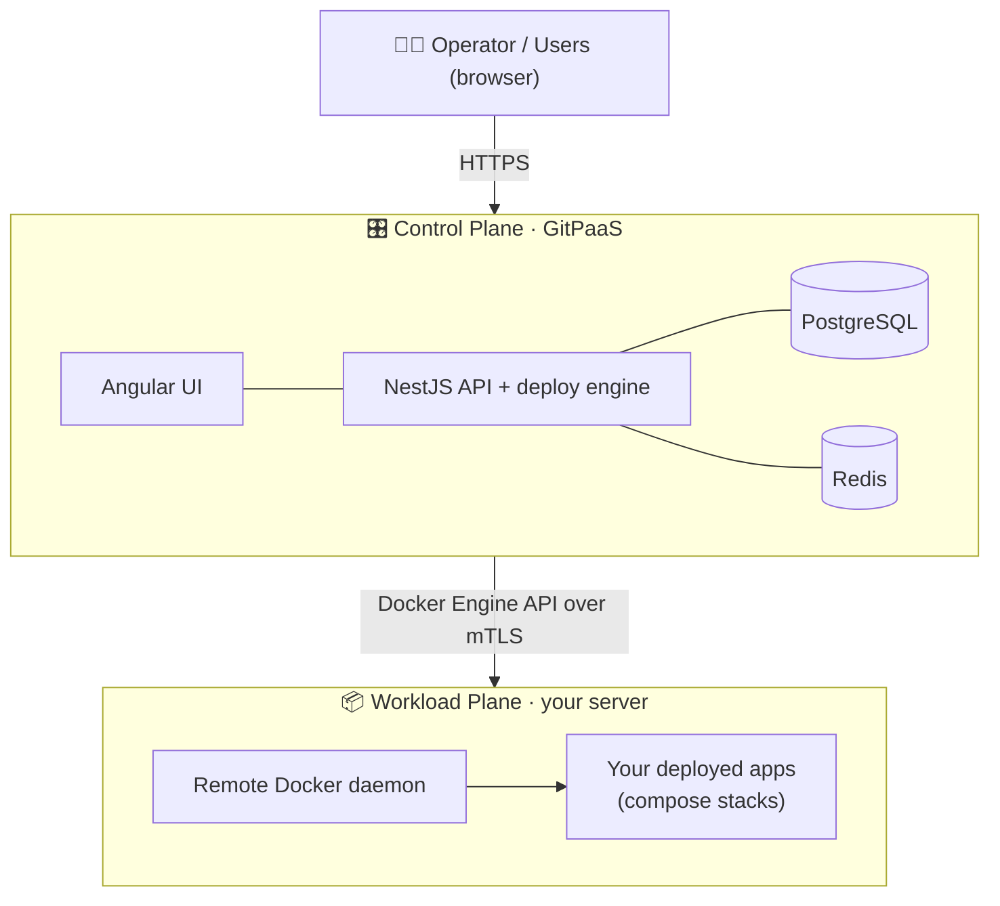

<div align="center">

# 🚀 GitPaaS

### Your apps. Your servers. Your platform.

**GitPaaS is an open, self-hostable PaaS** — install it on your own server and deploy applications straight from git, the way you would with Vercel, Dokploy, or Coolify. Except here, *you* own the infrastructure end to end.

<br />

[](https://nestjs.com/)
[](https://angular.dev/)
[](https://www.typescriptlang.org/)
[](https://www.postgresql.org/)
[](https://redis.io/)
[](https://www.docker.com/)

[](https://github.com/orgs/gitopslovers/packages)
[](./CONTRIBUTING.md)
[](./LICENSE)
[](./docs/deployment-roadmap.md)

</div>

---

## 🌟 What is GitPaaS?

Point GitPaaS at a git repository and it does the rest: it clones the repo at a specific commit, builds or pulls the images, and runs the resulting `docker-compose` stack on a Docker host you control — with a durable deployment queue and **live log streaming** to your browser.

There is no managed cloud in the middle. The platform and the apps it runs both live on *your* servers. You get the convenience of a modern PaaS with the control and privacy of self-hosting.

> 💡 **In one line:** GitPaaS is the control panel; your server is the runway.

---

## ✨ Features

|    | Feature                      | What it means for you                                                                                                             |
|----|------------------------------|-----------------------------------------------------------------------------------------------------------------------------------|
| 🔀 | **Git-based deploys**        | Deploy any repo at a resolved commit — builds the `build:` services, pulls the rest, and brings the compose stack up.             |
| 📬 | **Durable deployment queue** | DB-backed, at-least-once queue with bounded retries, dead-lettering, and restart recovery. In-flight work survives a restart.     |
| 📡 | **Live log streaming**       | Deployment output streams to the browser over Server-Sent Events *and* is persisted, so history is replayable after the run ends. |
| 🔐 | **Remote Docker over mTLS**  | The control plane drives a remote Docker daemon over mutually-authenticated TLS — the same runtime model as Coolify and Dokploy.  |
| 🏠 | **Own your infrastructure**  | Self-hosted by design. Your code, your data, your servers — no third-party platform in between.                                   |
| 🐙 | **GitHub App integration**   | Browse repositories and branches, resolve commits, and pull archives through a GitHub App.                                        |
| 🛡️ | **Built-in authentication**  | JWT with refresh-token rotation and argon2 password hashing.                                                                      |
| 🩺 | **Operational tooling**      | Readiness probes for PostgreSQL, Redis, and Docker, plus image/volume/container pruning and read-only inspection.                 |

---

## 🧭 How it works

GitPaaS splits cleanly into **two planes** — and keeping them separate is the core idea of the whole design.

- **🎛️ Control plane** — GitPaaS *itself*: a NestJS API + deploy engine, an Angular web UI, plus its own **PostgreSQL** (durable state) and **Redis** (live log buffer + pub/sub). This is what you install and log into.
- **📦 Workload plane** — a **remote Docker host** where your deployed apps actually run. The control plane never runs your workloads in its own containers; it reaches out to a Docker daemon over the network via **mTLS** and brings your compose stacks up there.


```mermaid
flowchart TD
    U["🧑‍💻 Operator / Users (browser)"] -->|HTTPS| CP

    subgraph CP["🎛️ Control Plane · GitPaaS"]
        FE["Angular UI"] --- BE["NestJS API + deploy engine"]
        BE --- PG[("PostgreSQL")]
        BE --- RD[("Redis")]
    end

    CP -->|"Docker Engine API over mTLS"| WP

    subgraph WP["📦 Workload Plane · your server"]
        DK["Remote Docker daemon"] --> APPS["Your deployed apps<br/>(compose stacks)"]
    end
```

A single deployment is one self-contained unit of work — *"bring this service's compose stack up on the server"* — orchestrated end to end by the control plane, streamed live, and recorded for replay.

📖 Dive deeper in the [Infrastructure Architecture](./docs/infrastructure-architecture.md).

---

## 🚀 Install

Self-host GitPaaS on your own server with a single command.

### Prerequisites

- **A Linux server** for the control plane, with `curl`, `openssl`, and `tar` available. **Docker** is required — the installer provisions Docker and the compose plugin for you if they're missing.
- **A remote Docker host** where your deployed apps will run. The installer generates the mTLS certificates for it; you install the server certs there and enable Docker's TLS socket. This can be wired up after the initial install.

### One-line installer

On a fresh server, install and start the whole control plane with a single command:

```bash
curl -fsSL https://raw.githubusercontent.com/GitOpsLovers/gitpaas/main/scripts/install.sh | sh
```

The installer provisions Docker if it's missing, fetches the source, generates the mTLS material, writes `iac/production/.env` with secure random secrets, brings up the production stack, runs the database migrations, and seeds your **first admin** (it prompts for an email and prints a generated password once — copy it). When it finishes it prints your URLs.

It installs the **`latest`** release by default. Pin a specific version with `--version` (or the `GITPAAS_VERSION` env var):

```bash
# Pin a specific release
curl -fsSL https://raw.githubusercontent.com/GitOpsLovers/gitpaas/main/scripts/install.sh | sh -s -- --version v1.0.0
```

Key options (each flag has an environment-variable equivalent):

| Flag                   | Env var               | Default        | Purpose                                                     |
|------------------------|-----------------------|----------------|-------------------------------------------------------------|
| `--version <ref>`      | `GITPAAS_VERSION`     | `latest`       | Release tag (or branch) to install.                         |
| `--dir <path>`         | `GITPAAS_DIR`         | `/opt/gitpaas` | Directory the source is installed into.                     |
| `--email <email>`      | `GITPAAS_ADMIN_EMAIL` | *(prompted)*   | First admin's email; skips the interactive prompt.          |
| `--docker-host <host>` | `GITPAAS_DOCKER_HOST` | *(empty)*      | Remote Docker host baked into the server cert and `.env`.   |

The installer is safe to re-run: existing certificates and `.env` are preserved, and the admin seed is idempotent.

---

## 📚 Documentation

| Doc                                                                     | What's inside                                                    |
|-------------------------------------------------------------------------|------------------------------------------------------------------|
| 🧩 [Backend Architecture](./docs/backend-architecture.md)               | The NestJS API's hexagonal layout, ports & adapters, persistence |
| 💼 [Backend Business](./docs/backend-business.md)                       | The domain workflows behind the deploy engine                    |
| 🎨 [Frontend Architecture](./docs/frontend-architecture.md)             | The Angular SPA's feature folders, layering, and conventions     |
| 🏗️ [Infrastructure Architecture](./docs/infrastructure-architecture.md) | The two-plane model, dev vs. production, and image publishing    |
| 🗺️ [Deployment Roadmap](./docs/deployment-roadmap.md)                   | The product vision and the phased path to a full PaaS            |

---

---

## 🤝 Contributing

Contributions are warmly welcome! 🎉 Whether it's a bug fix, a doc tweak, or a whole new feature, we'd love your help pushing GitPaaS toward the full PaaS vision.

📖 See **[CONTRIBUTING.md](./CONTRIBUTING.md)** for setup and workflow.

---

## 📄 License

Released under the [MIT License](./LICENSE).

---

<div align="center">

Made with ❤️ by **GitOpsLovers**

</div>
