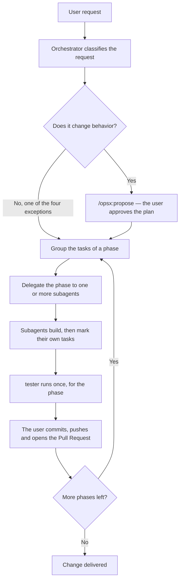

# Key flows

## The path of a request, from the user to a merge

The orchestrator is the main agent, in conversation with the user. It never implements, refactors
or documents the code itself; it classifies the request, it delegates, and it relays the result. A
subagent starts with no history of the conversation, so it reads its own prompt, its own agent
file, and the files that the prompt names.

The orchestrator implements nothing, for one reason. A cold subagent reads one skill, one agent
file and the paths of the prompt; the orchestrator carries the conversation of the whole request.
If the orchestrator also edited code, every edit would carry that larger context, and every edit
would cost more tokens than the same edit made by a subagent. The rule that splits the two roles,
and the eight steps of the workflow, live in `.claude/skills/agent-orchestration/SKILL.md`. This
page names the skill as the source of the workflow; it does not restate the eight steps.

A phase is the unit of delivery because a change can span many files and many subagents, and a
reviewer needs one phase, and not the whole change, to judge one Pull Request. A phase that groups
its own tasks, its own test run and its own delivery keeps a Pull Request small enough to review,
and it lets the user stop after a phase that reveals a wrong plan, before the next phase builds on
it.

**The delivery today.** The user owns every operation of Git. A subagent, whichever kind it is,
leaves its work in the tree; it creates no branch and no commit, and it opens no Pull Request. The
skill `agent-orchestration` still names `git-manager` for this step; read the rules of the
delegation there, and read the note above for the practice of today. The check
`.github/workflows/pr-agents-changelog.yml` waits on a Pull Request against `main` that touches one
of its four watched paths; because no Pull Request of this project has started yet, the check has
never run.

## The choice of the agent

Six subagents exist, and not one, because a single agent that reads, writes, tests, refactors and
documents would carry the tools and the caution of all five jobs on every task, even the small one.
A subagent that loads only its own job stays cheaper to start, and its prompt states one prime
directive, so its output is easier to judge against that one directive.

The border between `implementer`, `refactorer` and `tester` protects the same thing from three
sides: the behavior of the application.

- `implementer` changes behavior on purpose. It builds a feature, wires an endpoint, or fixes a
  bug, and it writes the test of the unit that it builds.
- `refactorer` restructures code and keeps the behavior identical. It has no license to add a
  feature or to fix a bug that it notices; it reports that finding instead.
- `tester` writes or repairs a test and changes no product code. When a test only passes after a
  change of product code, that is a product bug, and `tester` reports it rather than fixing it.

Three agents that each guard one edge of "does this change behavior" catch a slip that one broad
agent would miss: a refactor that quietly fixes a bug, or a test that quietly changes the code
under test. The choice of the agent for each kind of task is in section 2 of
`.claude/skills/agent-orchestration/SKILL.md`.

A subagent never spawns another subagent, because only the orchestrator carries the classification
of the request and the plan of the phases. A subagent that could spawn a subagent would need that
same context, and it would need the same judgment about the specification, the phase and the
agent to pick. Giving that judgment to six agents instead of one would let two agents delegate the
same task twice, or delegate it to different agents. Keeping the judgment in the orchestrator alone
keeps one decision in one place.

## The border between the `opsx` commands and the six subagents

An OpenSpec change and a subagent answer two different questions. The `opsx` commands
(`/opsx:propose`, `/opsx:update`, `/opsx:sync`, `/opsx:archive`) own the specification: the
requirement, written as `### Requirement:` with `SHALL`, and the scenario, written as
`#### Scenario:` with `WHEN` and `THEN`, under `openspec/specs/`. They state what the system must
do. The six subagents own the code: the implementation, the test, the refactor, the document and
the audit that make the requirement true, or that describe it once it is true.

This border is why `tester` reads the scenarios of the specification before it writes a test, and
why `documenter` links a capability under `openspec/specs/` instead of restating its rule in
`docs/`. A page of `docs/` and a scenario of `openspec/specs/` that both state one rule go out of
step the day one of them changes; the specification stays the one place that states the rule, and
the code and the documentation both point to it.
