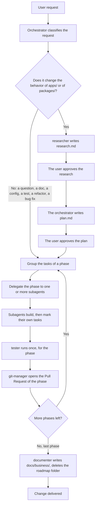

# Key flows

## The path of a request, from the user to a merge

The orchestrator is the main agent, in conversation with the user. It never implements, refactors
or documents the code itself; it classifies the request, it delegates, and it relays the result. A
subagent starts with no history of the conversation, so it reads its own prompt, its own agent
file, and the files that the prompt names.

The orchestrator implements nothing, for one reason. A cold subagent reads one skill, one agent
file and the paths of the prompt; the orchestrator carries the conversation of the whole request.
If the orchestrator also edited code, every edit would carry that larger context, and every edit
would cost more tokens than the same edit made by a subagent. The rule that splits the two roles,
the two roads of a request, and the three phases of the cycle, live in
`.claude/skills/agent-orchestration/SKILL.md`. This page names the skill as the source of the
workflow; it does not restate its steps.

A phase is the unit of delivery because a change can span many files and many subagents, and a
reviewer needs one phase, and not the whole change, to judge one Pull Request. A phase that groups
its own tasks, its own test run and its own delivery keeps a Pull Request small enough to review,
and it lets the user stop after a phase that reveals a wrong plan, before the next phase builds on
it.

**The delivery today.** `git-manager` opens the branch, the commit, the push and the Pull Request
of every phase. The user confirms nothing before that Pull Request opens; the user's own review of
the Pull Request, and the merge that follows it, are the check on the work.

## The choice of the agent

Six subagents exist, and not one, because a single agent that reads, writes, tests, refactors and
documents would carry the tools and the caution of all five jobs on every task, even the small one.
A subagent that loads only its own job stays cheaper to start, and its prompt states one prime
directive, so its output is easier to judge against that one directive.

The border between `implementer`, `refactorer` and `tester` protects the same thing from three
sides: the behavior of the application.

- `implementer` changes behavior on purpose. It builds a feature, wires an endpoint, or fixes a
  bug, and it writes the test of the unit that it builds.
- `refactorer` restructures code and keeps the behavior identical. It has no license to add a
  feature or to fix a bug that it notices; it reports that finding instead.
- `tester` writes or repairs a test and changes no product code. When a test only passes after a
  change of product code, that is a product bug, and `tester` reports it rather than fixing it.

Three agents that each guard one edge of "does this change behavior" catch a slip that one broad
agent would miss: a refactor that quietly fixes a bug, or a test that quietly changes the code
under test. The choice of the agent for each kind of task is in section 3 of
`.claude/skills/agent-orchestration/SKILL.md`.

`researcher` carries two jobs, and both read the code and write no code. The first job is
the research of the cycle: it writes `docs/roadmap/<feature>/research.md`, so a plan starts from
what the system does today, and not from a guess. The second job is the audit: a report on the
structure of the code, on request, with no feature and no `research.md` attached to it.

A subagent never spawns another subagent, because only the orchestrator carries the classification
of the request and the plan of the phases. A subagent that could spawn a subagent would need that
same context, and it would need the same judgment about the specification, the phase and the
agent to pick. Giving that judgment to six agents instead of one would let two agents delegate the
same task twice, or delegate it to different agents. Keeping the judgment in the orchestrator alone
keeps one decision in one place.

## The border between `docs/business/`, `docs/roadmap/` and `docs/architecture/`

The three areas of `docs/` answer three different questions, and a page of one area never restates
the rule of another. `docs/business/` states what the system does today, as a rule written with
`SHALL` and one scenario for each case that proves it; `tester` derives its test cases from those
scenarios. `docs/roadmap/<feature>/` states what a future feature must do, and it is the working
folder of the cycle: `TODO.md`, then `research.md`, then `plan.md`. The five areas of
`docs/architecture/` state how the system is built: the stack, the structure, the conventions, the flows and the
operations.

This border is why the last phase of every feature goes to `documenter`. It writes the new
behavior into `docs/business/`, corrects the page that the feature made false, and deletes
`docs/roadmap/<feature>/`. A page of the architecture that needs a rule links the page of
`docs/business/` instead of restating it; a page of `docs/business/` that needs the mechanism links
the `key-flows.md` of its area instead of restating it. Two copies of one rule go out of step the
day one of them changes; each rule stays true in the one place that states it, and every other page
points to it.
