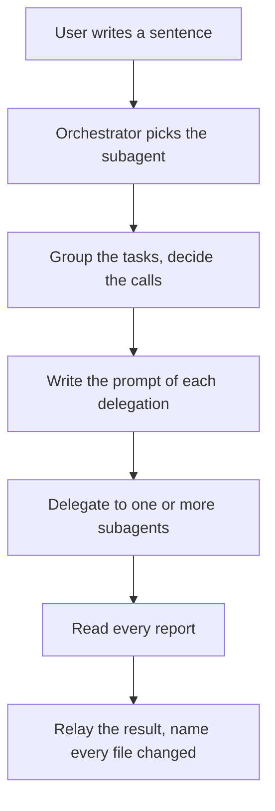
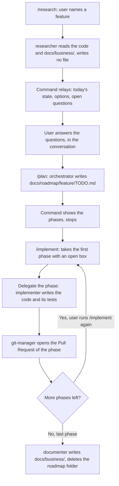

# Key flows

The layer holds two named workflows, and never a third shape of the cycle. The workflow of the day is a conversation, and the workflow of the SDD is three commands. Each one carries its own reason for the way it delivers the change; `.claude/skills/agent-orchestration/references/routing.md` gives the test that chooses one workflow over the other for a given request.

## The workflow of the day

The user writes a sentence that names no folder of `docs/roadmap/`, and the orchestrator delegates to one or more subagents. The change stays in the working tree.

**The reason of this delivery.** This workflow takes a question, a small fix, a test, a refactor that keeps the behavior, a document, a configuration and an audit — work with no specification to gate it. It invokes no `git-manager`, and it opens no Pull Request, because the user reviews and commits the change of a conversation directly; a Pull Request for every sentence would put a review step in front of work that carries no risk large enough to need one. `.claude/skills/agent-orchestration/references/workflow-day.md` gives the four steps in full, and `references/limits.md` states when the orchestrator may edit a file itself instead of delegating.

## The workflow of the SDD

The user runs `/research`, `/plan` and `/implement` in order, one command for one step, and each command is the gate: it runs, and it stops, so the user approves by typing the next command.

**The reason of this delivery.** `git-manager` runs one time inside `/implement` alone, and nowhere else in the layer, because only `/implement` produces code that changed the behavior of `apps/` or of `packages/` under a specification the user already approved in `TODO.md`. A phase is the unit of that delivery: it groups its own tasks, its own tests, and its own Pull Request, so a reviewer judges one phase and not the whole feature, and the user can stop after a phase that reveals a wrong plan, before the next phase builds on it. `docs/roadmap/<feature>/TODO.md` is the whole state of the work between two commands, so a new conversation can pick up `/plan` or `/implement` from that one file alone. `.claude/skills/agent-orchestration/references/workflow-sdd.md` gives the three commands in full.

## The choice of the agent

Four subagents exist, and not one, because a single agent that reads, writes and documents would carry the tools and the caution of every job on every task, even the small one. A subagent that loads only its own job stays cheaper to start, and its prompt states one prime directive, so its output is easier to judge against that one directive.

The border that matters is the border of the code. `implementer` holds every change of the code of `apps/` and of `packages/`, and no other agent writes a line of it.

- It changes behavior on purpose: it builds a feature, wires an endpoint, or fixes a bug.
- It restructures code and keeps the observable behavior identical, when the task asks for a restructure alone.
- It writes and repairs the tests of the code that it changes, in the same call.

The code and its tests moved into one agent because the split cost more than it caught. A change and its coverage travel together: one agent that holds both writes the seam and the spec in one context, and the phase takes one call instead of two cold starts that read the same files. The rule that the split protected stays in the prompt of the agent: the agent names the kind of its change, a restructure that would alter the behavior stops and reports, and a test that passes only after an unasked change of product code is a product bug to report. The choice of the agent for each kind of task is in `.claude/skills/agent-orchestration/references/which-agent.md`.

`researcher` carries two jobs, and both read the code and write no code. The first job is the research of the cycle: it reports what the system does today, so the tasks start from a fact, and not from a guess. That report stays in the conversation and reaches no file, because the orchestrator needs it one time alone, and a file of research costs every later agent the tokens to read it. The second job is the audit: a report on the structure of the code, on request, with no feature attached to it.

A subagent never spawns another subagent, because only the orchestrator carries the classification of the request and the plan of the phases. A subagent that could spawn a subagent would need that same context, and it would need the same judgment about the specification, the phase and the agent to pick. Giving that judgment to four agents instead of one would let two agents delegate the same task twice, or delegate it to different agents. Keeping the judgment in the orchestrator alone keeps one decision in one place.

## The border between `docs/business/`, `docs/roadmap/` and `docs/architecture/`

The three areas of `docs/` answer three different questions, and a page of one area never restates the rule of another. `docs/business/` states what the system does today, as a rule written with `SHALL` and one scenario for each case that proves it; `implementer` derives its test cases from those scenarios. `docs/roadmap/<feature>/` states what a future feature must do, and it is the working folder of the cycle. It holds one file, `TODO.md`: a short introduction, then the phases with their tasks. The five areas of `docs/architecture/` state how the system is built: the stack, the structure, the conventions, the flows and the operations.

This border is why the last phase of every feature goes to `documenter`. It writes the new behavior into `docs/business/`, corrects the page that the feature made false, and deletes
`docs/roadmap/<feature>/`. A page of the architecture that needs a rule links the page of `docs/business/` instead of restating it; a page of `docs/business/` that needs the mechanism links the `key-flows.md` of its area instead of restating it. Two copies of one rule go out of step the day one of them changes; each rule stays true in the one place that states it, and every other page points to it.
