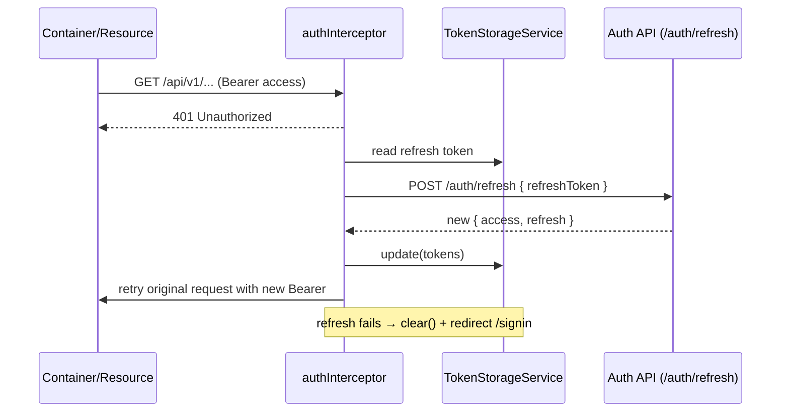

# Frontend Architecture

This document defines the **general architectural principles** of the frontend app (`apps/frontend`). It describes how the app is structured and *why*, so that every feature
stays consistent. For the step-by-step procedure to build or change a feature, use the `frontend-feature` skill.

## Overview

The frontend is an **Angular** SPA styled with **Tailwind CSS** (TailAdmin theme). It talks to the backend's REST API (`/api/v1`) and is organised as a set of **feature folders** with a layered structure — `domain` (types), `infrastructure` (data access and persistence), and `ui` (components, plus feature-local guards, interceptors, and services) — plus a shared application shell (`layout`), route-level `pages`, and cross-feature `shared` code.

Access to the app is gated by **client-side authentication** (JWT with refresh-token rotation): a public sign-in page and a guarded application shell. The feature set spans several domains (e.g. authentication, projects, and services), some of which are composed together on a single screen. See *Authentication* below.

### Tech stack

| Technology                   | Role                                               |
|------------------------------|----------------------------------------------------|
| Angular.                     | SPA framework                                      |
| `@angular/common/http`       | Data access (`httpResource` + `HttpClient`)        |
| Signals                      | State (`signal`, `linkedSignal`, `input`/`output`) |
| Tailwind CSS                 | Styling (TailAdmin theme)                          |
| Vitest                       | Unit testing                                       |
| TypeScript                   | Language                                           |

## Module wiring

The application is bootstrapped in `main.ts` via `bootstrapApplication(App, appConfig)`. The `appConfig` in `app.config.ts` registers:

- `provideBrowserGlobalErrorListeners()` — global error handling
- `provideRouter(routes, …)` — route definitions, with `withComponentInputBinding()` (route params bound as signal inputs, see *Pages*) and `withInMemoryScrolling(…)` (scroll-to-top / anchor scrolling on navigation)
- `provideHttpClient(withInterceptors([authInterceptor]))` — HTTP client with the authentication interceptor (see *Authentication*)

```
main.ts → bootstrapApplication(App, appConfig)
  app.config.ts
    ├── provideBrowserGlobalErrorListeners()
    ├── provideRouter(routes, withComponentInputBinding(), withInMemoryScrolling(…))
    └── provideHttpClient(withInterceptors([authInterceptor]))
```

The root `App` component is a thin host: its template is just `<router-outlet /><app-toast />`, so the global toast overlay (see *Shared*) renders above every route. It injects `ThemeService` on construction so the persisted theme is applied at startup.

Routes are defined in `app.routes.ts` in **two tiers**: a public `signin` route protected by `guestGuard` (already-authenticated users are bounced to the dashboard), and a root `''` shell route protected by `authGuard` that loads `LayoutComponent` and lazily loads every in-app page as a child. Unmatched paths (`**`) redirect to the dashboard. Lazy children use `loadComponent`; a feature with sub-pages is grouped as a **nested `children` block** under the feature path, and deeper resources nest further (e.g. services live under `projects/:id/services/…`, with a tabbed detail route and a redirect to a default tab). See the full route table in `apps/frontend/src/app/app.routes.ts`.

## Path aliases

TypeScript path aliases (defined in `apps/frontend/tsconfig.json`) give each top-level area a stable, absolute import prefix — used throughout routes, pages, containers, and components:

| Alias         | Path                   |
|---------------|------------------------|
| `@features/*` | `./src/app/features/*` |
| `@layout/*`   | `./src/app/layout/*`   |
| `@pages/*`    | `./src/app/pages/*`    |
| `@shared/*`   | `./src/app/shared/*`   |

## Scripts

Defined in `apps/frontend/package.json`:

| Script  | Command                                        |
|---------|------------------------------------------------|
| `dev`   | `ng serve`                                     |
| `build` | `ng build`                                     |
| `watch` | `ng build --watch --configuration development` |
| `lint`  | `eslint .`                                     |
| `test`  | `ng test`                                      |

## Architecture per feature

Each feature follows a layered structure. The three layers are always present in some form; the sub-folders shown are the ones a feature uses when it needs them — a simple feature may only have `domain/models/` and `infrastructure/api/`, while a richer feature (e.g. authentication) uses every slot:

```
features/<feature>/
  domain/
    models/             — the domain model interface(s), e.g. <entity>.model.ts
    dtos/               — Create/Update/request DTO interfaces (request payloads)
  infrastructure/
    api/                — API data access (<feature>-api.repository.ts)
    storage/            — browser-persistence services (e.g. token storage), when the feature persists state
  ui/
    containers/         — smart components: inject and provide the API repository, own state, orchestrate commands
    components/         — purely presentational components (signal inputs/outputs, no injected services)
    guards/             — functional route guards (CanActivateFn), when the feature protects routes
    interceptors/       — functional HTTP interceptors (HttpInterceptorFn), when the feature hooks the HTTP pipeline
    services/           — root-provided stateful services owning feature session/state, when the feature has cross-screen state
```

**All business logic lives in the feature**, never in pages. Every screen is a smart **container** that injects the repository, holds the state signals, and issues the create/update/delete/read commands. Presentational **components** only render and emit — a container wraps them.

> **Guards and interceptors live in the feature `ui/` layer**, not in `infrastructure/`. They are UI-pipeline concerns (routing, HTTP), so `ui/guards/` and `ui/interceptors/` are the canonical homes. Browser persistence (localStorage/sessionStorage) is a data concern and lives in `infrastructure/storage/`.

Not every feature owns a page. Some expose only components and a repository that a **cross-feature container composes** onto another feature's screen — for example, the service-detail screen pulls in child components and repositories from sibling features (deployments, containers, networks) rather than each of those owning its own route. Other features are intentionally model-only (a `domain/models/` type consumed elsewhere, with no UI or repository yet). Document the pattern, not the roster: the shape is "a feature contributes the slots it needs, and screens are assembled by composition."

### API data access (Infrastructure layer)

The infrastructure layer contains one `@Injectable()` repository per feature (`<feature>-api.repository.ts`) that owns all HTTP access, following the [Angular `httpResource` guide](https://angular.dev/guide/http/http-resource): **reads use `httpResource`, mutations use `HttpClient` directly**.

- **Reads → `httpResource`**: reactive collections/records exposed as a resource with `isLoading()`, `error()`, `hasValue()`, `value()`, `status()`, and `reload()`. A read parameterised by an id is a factory method returning a resource keyed off an accessor (`serviceById(() => id)`), idle until the accessor yields a value.
- **Mutations (POST/PUT/DELETE) → `HttpClient`**: `create`/`update`/`delete` are thin methods returning a single-emission `Observable`. Containers consume them with `lastValueFrom` and `async`/`await` (not manual `subscribe`). The guide explicitly recommends `HttpClient` over `httpResource` for mutations. After a successful mutation the caller calls `.reload()` on the relevant read resource to refresh it. Long-lived, multi-emission streams (e.g. an SSE/`EventSource` log stream) are the exception: those return an `Observable` the container `subscribe`s to and tears down explicitly.

The reference implementation — the `projects` resource read, the `projectById` id-keyed factory read, and the `create`/`update`/`delete` mutations — lives in `apps/frontend/src/app/features/projects/infrastructure/api/projects-api.repository.ts`.

The repository is **not** `providedIn: 'root'`; it is `@Injectable()` and provided by the smart **container** that uses it (`providers: [ProjectsApiRepository]`), so each screen gets its own instance and a fresh fetch.

### Containers (UI layer)

Smart components provide and inject the API repository, expose its read resources to the template, and issue mutations (awaited via `lastValueFrom`, with navigation/toasts on success). They live in `ui/containers/`. There is **one container per screen** — `projects-list` (read + delete, in `apps/frontend/src/app/features/projects/ui/containers/projects-list/projects-list.component.ts`), `project-add` (create, in `apps/frontend/src/app/features/projects/ui/containers/project-add/project-add.component.ts`), `project-edit` (load + update, in `apps/frontend/src/app/features/projects/ui/containers/project-edit/project-edit.component.ts`).

The list template drives its own states off the resource: `@if (projects.isLoading())` / `@else if (projects.error())` / `@else if (projects.hasValue())`, with an empty-state branch (`apps/frontend/src/app/features/projects/ui/containers/projects-list/projects-list.component.html`).

The command containers own a `submitting` signal (toggled around the awaited call), wrap the presentational form, and navigate on success. The mutation is awaited inside a `try/catch`: the success path shows a toast and navigates, and `submitting` is reset in `catch` — the success path deliberately leaves it set because the container navigates away. (A container that stays on screen after a mutation should reset the flag in a `finally` instead.) `project-add` creates; `project-edit` additionally reads the route param and pre-loads the record through a `projectById` read resource (deriving `initialName`/`loading` from it, rendering a loading branch until it resolves).

Reads-that-feed-a-view (e.g. syncing a saved record back into a detail resource) can still write to a resource's `value` signal — for example `this.service.value.set(updated)` after a provider save.

### Presentational components (UI layer)

Purely presentational components use **signal inputs/outputs** (`input()`, `output()`), never inject services, and focus on rendering. They live under `ui/components/`. The reusable **`ProjectFormComponent`** (`apps/frontend/src/app/features/projects/ui/components/project-form/project-form.component.ts`) is the reference: it takes `initialName`/`submitting`/`submitLabel` inputs, seeds its editable field with `linkedSignal(() => this.initialName())`, and emits the trimmed value through a `save` output — leaving the actual create/update call to its parent **container**.

## Authentication

Authentication is a full feature (`features/authentication`) that gates the whole app and demonstrates every `ui/`/`infrastructure/` sub-layer. The backend issues a JWT **access token** plus a **refresh token** and rotates them; the frontend persists that pair, attaches it to API traffic, and transparently refreshes it.

The pieces and their responsibilities:

- **`infrastructure/api` — `AuthenticationApiRepository`** (`providedIn: 'root'`): thin `HttpClient` calls to the public auth endpoints — `login`, `refresh` (rotate), `logout` (revoke), and `me` (current user). These are mutations/commands, so they return `Observable`s, consistent with the read/write split below.
- **`infrastructure/storage` — `TokenStorageService`** (`providedIn: 'root'`): the single owner of token persistence. It stores the pair in `localStorage` when the user opts to "remember me" and in `sessionStorage` otherwise, exposes the tokens as read-only signals, and **hydrates from whichever storage holds them on startup** so a page refresh keeps the session. It also updates the pair after a rotation and clears both storages on logout.
- **`ui/services` — `AuthService`** (`providedIn: 'root'`): the session state and flows. It derives an `isAuthenticated` computed from the stored access token, exposes the loaded `currentUser` signal, and orchestrates `login` (persist tokens + navigate), `logout` (revoke server-side, clear storage, return to sign-in), and `loadCurrentUser`. It coordinates the repository, token storage, and router.
- **`ui/guards` — `authGuard` / `guestGuard`**: functional `CanActivateFn`s. `authGuard` protects the app shell (redirects to `/signin` when there is no token); `guestGuard` protects the sign-in route (redirects to `/dashboard` when already signed in). Both read the token straight from `TokenStorageService`.
- **`ui/interceptors` — `authInterceptor`**: a functional `HttpInterceptorFn`, registered globally in `app.config.ts`. It attaches `Authorization: Bearer <accessToken>` only to backend API requests, letting the public `/auth/` endpoints and non-API traffic pass through untouched. On a `401` for a protected request it attempts **a single token refresh and retries the original request** with the new token; if the refresh fails (or there is no refresh token) it clears the session and redirects to `/signin`.
- **`ui/containers/signin`**: the smart sign-in container that drives the login form and calls `AuthService.login`. The public `pages/auth/signin` page hosts it (thin page, see *Pages*).

The refresh-retry flow:



## Layout

The layout layer provides the application shell:

```
layout/
  ui/
    components/         — shell UI pieces (e.g. sidebar, header, breadcrumb)
    containers/         — the root layout container that wraps the router-outlet
    services/           — shell state services (e.g. sidebar, theme)
```

The `LayoutComponent` is the root route wrapper that renders the sidebar, header, and the routed page via `<router-outlet>`. The header injects `AuthService` and exposes a user menu whose logout action calls `AuthService.logout()`.

**State-management in the shell is mixed, by porting origin.** The theme service is signal-based, but the sidebar service (`SidebarService`, `providedIn: 'root'`) is **RxJS-based** — it exposes expanded / hovered / mobile-open state as `BehaviorSubject`-backed observables that the layout consumes via the `async` pipe. This is a deliberate holdover from the TailAdmin port; new feature state should prefer signals, and this is the documented exception for the shell.

**`BreadcrumbComponent`** (`app-breadcrumb`) is the standard page header, ported from the TailAdmin theme. It takes a `pageTitle` signal input and renders the title plus a `Home › {{ pageTitle }}` trail. Every page places it as its first element.

## Pages

Page components are the route-level components in `pages/`, nested per feature under `pages/<feature>/{list,add,edit}/`. Each is a `<name>.component.ts`, its class is suffixed `Page` (`ProjectsListPage`, `ProjectsAddPage`, `ProjectsEditPage`) and its selector `app-<feature>-<action>-page`.

**Pages are thin — they only compose components; they hold no business logic and inject no services.** A page renders the `<app-breadcrumb>` header and drops in the feature's smart container. Most page classes are empty — see the add page in `apps/frontend/src/app/pages/projects/add/project-add.component.ts` and its template `apps/frontend/src/app/pages/projects/add/project-add.component.html`, which just places `<app-breadcrumb>` above the feature container.

The state, repository, and command orchestration that used to live on the add/edit pages now live in their `project-add` / `project-edit` containers (see *Containers*).

**Route params enter through the page, not the container.** The router is configured with `withComponentInputBinding()`, so a routed page receives its route params as **signal inputs whose names match the params** (`:id` → `id`, `:serviceId` → `serviceId`). The page forwards them to its container as inputs — the container reads them via `input.required<string>()` rather than injecting `ActivatedRoute`. This keeps route-reading a page concern (still no service injection, no business logic) and leaves the container decoupled from routing and independently testable by setting inputs. The service-detail page shows the pattern: `apps/frontend/src/app/pages/services/detail/service-detail.component.ts` binds the `:id`/`:serviceId` route params as signal inputs and `apps/frontend/src/app/pages/services/detail/service-detail.component.html` forwards them to the container.

## Data flow

**Reads** (list):

```
Browser → Route → LayoutComponent → Page → Container → ProjectsApiRepository.projects (httpResource) → HTTP GET → Backend
```

Example — `GET /projects`:

1. User navigates to `/projects`.
2. `ProjectsListPage` renders `ProjectsListComponent`.
3. `ProjectsListComponent` reads `ProjectsApiRepository.projects` (the `httpResource`).
4. `httpResource` issues `GET http://localhost:3000/api/v1/projects`.
5. The template renders loading/error/value/empty states off the resource signals.

**Commands** (create/update/delete):

```
Container → ProjectsApiRepository.create|update|delete (HttpClient) → HTTP → Backend → resource.reload() / router.navigate
```

Example — creating a project:

1. `ProjectFormComponent` emits the trimmed name via its `save` output.
2. `ProjectAddComponent.create(name)` (the container) calls `ProjectsApiRepository.create({ name })`.
3. On success it navigates back to `/projects`; the fresh `ProjectsListComponent` instance re-fetches. (An in-place delete instead calls `projects.reload()`.)

## Shared

`shared/` holds cross-feature code that is not tied to a single domain. It has grown past UI primitives into three slots:

```
shared/
  components/         — reusable presentational UI primitives (one flat folder per component)
  services/           — cross-cutting, root-provided services (e.g. the global toast stack)
  pipes/              — reusable template pipes (e.g. safe-html for trusted markup)
```

The **toast system** is the reference cross-cutting service. `ToastService` (`providedIn: 'root'`) owns a signal-backed stack of toasts with typed `success`/`error`/`warning`/`info` helpers and auto-dismissal; the presentational `ToastComponent` renders that stack and is mounted once, globally, in the root `App` template (see *Module wiring*). Any container calls the service; the single host renders the result. The `SafeHtmlPipe` marks a trusted HTML string (e.g. inline SVG) safe for `[innerHTML]`.

### Shared components

Cross-feature, reusable UI primitives live in `shared/components/<name>/<name>.component.{ts,html}` (one flat folder per component, no grouping subfolders). Most are ported from the TailAdmin theme; a few **wrap a third-party library** behind the shared contract — for example the select control wraps `@ng-select/ng-select` so callers depend on the in-house `app-select2` API rather than the vendor component directly. They follow a common contract:

- **Selector** `app-<name>`; class `…Component`.
- **Signal inputs only** — `input()` for optional, `input.required()` for mandatory. No `@Input()` decorators. Event outputs are emitted via outputs.
- **No `CommonModule`/`ngClass`.** Dynamic classes are built with `[class]` bindings (or a `get …Classes()` accessor) and string interpolation, keeping the imports minimal.
- **Style extension via a `className` input**, appended to the component's own Tailwind classes so callers can tweak width/spacing without forking the component.

For example, `ButtonComponent` (`app-button`) exposes `variant`/`size`/`disabled` signal inputs and builds its class string from `get …Classes()` accessors, while a titled card wraps arbitrary content through `<ng-content>`.

The Tailwind design tokens these rely on (`brand-*`, `error-*`, `success-*`, …) are defined in the `@theme` block of the app's global stylesheet, ported from TailAdmin.