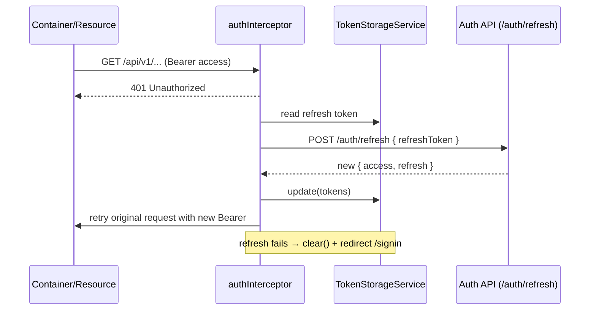

# Frontend architecture

Architectural principles of `apps/frontend`: an Angular SPA, styled with Tailwind CSS, that consumes the backend REST API. For the step-by-step procedure to build or change a feature use the `frontend-feature` skill.

## Overview

The app is organised as **feature folders** with a layered structure — `domain` (types), `infrastructure` (data access and browser persistence), `ui` (components plus feature-local guards, interceptors, and services) — around a shared application shell (`layout`), route-level `pages`, and cross-feature `shared` code. Access is gated by client-side JWT authentication with refresh-token rotation: a public sign-in route and a guarded application shell.

## Stack

| Concern      | Tool                                                        |
|--------------|-------------------------------------------------------------|
| Framework    | Angular 22, standalone components, `bootstrapApplication` |
| Data access  | `@angular/common/http` — `httpResource` (reads) + `HttpClient` (mutations) |
| State        | Signals (`signal`, `computed`, `linkedSignal`, `input`/`output`) |
| Styling      | Tailwind CSS 4 (TailAdmin theme)                            |
| UI libraries | `@lucide/angular`, `@ng-select/ng-select` (wrapped, never used directly by callers) |
| Testing      | Vitest (`*.spec.ts`)                                        |

## Structure

### Bootstrap and routing

`main.ts` calls `bootstrapApplication(App, appConfig)`. `app.config.ts` registers:

```text
provideBrowserGlobalErrorListeners()
provideRouter(routes, withComponentInputBinding(), withInMemoryScrolling(…))
provideHttpClient(withInterceptors([authInterceptor]))
```

The root `App` is a thin host — its template is `<router-outlet /><app-toast />`, so the global toast overlay renders above every route. It injects `ThemeService` (applies the persisted theme at startup) and `Title`.

`app.routes.ts` defines **two tiers**: a public `signin` route protected by `guestGuard` (authenticated users bounce to the dashboard), and a root `''` shell route protected by `authGuard` that loads `LayoutComponent` and lazily loads every in-app page as a child. Unmatched paths redirect to the dashboard. Lazy children use `loadComponent`; a feature with sub-pages is a nested `children` block under the feature path, and deeper resources nest further (e.g. services live under `projects/:id/services/…`, with a tabbed detail route and a redirect to a default tab). Each route sets a `title`.

### Per-feature layout

The three layers are always present in some form; sub-folders appear only when the feature needs them. A simple feature has just `domain/models/` and `infrastructure/api/`; a rich one (e.g. `authentication`) uses every slot.

```text
features/<feature>/
  domain/
    models/         — domain model interfaces, <entity>.model.ts
    dtos/           — create/update/request payload interfaces
  infrastructure/
    api/            — API data access, <feature>-api.repository.ts
    storage/        — browser persistence (e.g. token storage)
  ui/
    containers/     — smart components: provide/inject the repository, own state, issue commands
    components/     — purely presentational (signal inputs/outputs, no injected services)
    guards/         — functional route guards (CanActivateFn)
    interceptors/   — functional HTTP interceptors (HttpInterceptorFn)
    services/       — root-provided services owning cross-screen feature state
```

Not every feature owns a page. Some expose only components and a repository that a **cross-feature container composes** onto another feature's screen — the service-detail screen pulls in child components and repositories from sibling features rather than each owning a route. Others are model-only. The shape is: a feature contributes the slots it needs, and screens are assembled by composition.

### Layout and pages

`layout/ui/{components,containers,services}/` holds the application shell. `LayoutComponent` is the root route wrapper rendering the sidebar, header, and `<router-outlet>`; the header injects `AuthService` for the user menu and logout. `BreadcrumbComponent` (`app-breadcrumb`) is the standard page header — it takes a `pageTitle` signal input and renders a `Home › {{ pageTitle }}` trail. Every page places it first.

`pages/` holds route-level components, nested per feature (`pages/<feature>/{list,add,edit,detail}/`). Class names are suffixed `Page`, selectors are `app-<feature>-<action>-page`.

### Shared

```text
shared/
  components/   — reusable presentational primitives (one flat folder per component)
  services/     — cross-cutting root-provided services (e.g. the toast stack)
  pipes/        — reusable template pipes (e.g. safe-html for trusted markup)
```

The toast system is the reference cross-cutting service: `ToastService` (`providedIn: 'root'`) owns a signal-backed stack with typed `success`/`error`/`warning`/`info` helpers and auto-dismissal; the presentational `ToastComponent` renders it and is mounted once, globally, in `App`.

## Conventions

### Layering

- **All business logic lives in the feature**, never in a page. Every screen is a smart container that injects the repository, holds the state signals, and issues commands.
- **Pages are thin** — they compose components, hold no logic, and inject no services. Most page classes are empty.
- **Route params enter through the page.** With `withComponentInputBinding()`, a routed page receives route params as signal inputs whose names match (`:id` → `id`, `:serviceId` → `serviceId`) and forwards them to its container as inputs. The container reads them via `input.required<string>()` instead of injecting `ActivatedRoute`, which keeps it decoupled from routing and testable by setting inputs.
- **Guards and interceptors live in `ui/`**, not `infrastructure/` — they are UI-pipeline concerns. Browser persistence (localStorage/sessionStorage) is a data concern and lives in `infrastructure/storage/`.

### API repositories

One `@Injectable()` repository per feature (`<feature>-api.repository.ts`) owns all HTTP access and derives its endpoints from `environment.apiBaseUrl`. Per the [Angular `httpResource` guide](https://angular.dev/guide/http/http-resource): **reads use `httpResource`, mutations use `HttpClient`.**

- **Reads** are exposed as resources with `isLoading()`, `error()`, `hasValue()`, `value()`, `status()`, `reload()`. A read parameterised by an id is a factory returning a resource keyed off an accessor (`projectById(() => id)`), idle until the accessor yields a value.
- **Mutations** (`create`/`update`/`delete`) are thin methods returning a single-emission `Observable`. Containers consume them with `lastValueFrom` and `async`/`await`, never manual `subscribe`, then call `.reload()` on the affected read resource. Long-lived multi-emission streams (e.g. an SSE log stream) are the exception: they return an `Observable` the container subscribes to and tears down explicitly.

A feature repository is **not** `providedIn: 'root'`; the smart container provides it (`providers: [ProjectsApiRepository]`), so each screen gets a fresh instance and a fresh fetch. Root-provided repositories are reserved for app-wide session concerns such as authentication.

Reference: [`projects-api.repository.ts`](../apps/frontend/src/app/features/projects/infrastructure/api/projects-api.repository.ts).

### Containers

One container per screen. A list container reads a resource and drives its own template states (`@if (x.isLoading())` / `@else if (x.error())` / `@else if (x.hasValue())`, plus an empty branch). A command container owns a `submitting` signal toggled around the awaited call, wraps a presentational form, and awaits the mutation inside `try/catch`: success shows a toast and navigates; a container that stays on screen resets the flag in `finally`, one that navigates away may leave it set. A container may write to a resource's `value` signal to sync a saved record back into a detail view (`this.service.value.set(updated)`).

### Presentational components

Purely presentational components render and emit; they never inject services. They use **signal inputs/outputs only** (`input()`, `input.required()`, `output()`) — no `@Input()` decorators. Shared primitives additionally follow:

- Selector `app-<name>`, class `…Component`, one flat folder `shared/components/<name>/<name>.component.{ts,html}`.
- **No `CommonModule`/`ngClass`** — dynamic classes come from `[class]` bindings or a `get …Classes()` accessor.
- **Style extension via a `className` input**, appended to the component's own Tailwind classes so callers can tweak spacing without forking.
- Third-party widgets are wrapped behind the in-house contract (e.g. the select control wraps `@ng-select/ng-select`).

Tailwind design tokens (`brand-*`, `error-*`, `success-*`, …) are defined in the `@theme` block of the global stylesheet, ported from TailAdmin.

### State

New state is signal-based. The documented exception is the shell's `SidebarService`, which is RxJS-based (`BehaviorSubject`-backed expanded/hovered/mobile-open state consumed via the `async` pipe) — a deliberate holdover from the TailAdmin port.

### Path aliases

`apps/frontend/tsconfig.json` gives each top-level area an absolute import prefix, used throughout routes, pages, containers, and components.

| Alias             | Path                       |
|-------------------|----------------------------|
| `@features/*`     | `./src/app/features/*`     |
| `@layout/*`       | `./src/app/layout/*`       |
| `@pages/*`        | `./src/app/pages/*`        |
| `@shared/*`       | `./src/app/shared/*`       |
| `@environments/*` | `./src/environments/*`     |

## Key flows

### Reads

```text
Route → LayoutComponent → Page → Container → <Feature>ApiRepository.<resource> (httpResource) → GET → backend
```

The container exposes the resource to its template, which renders loading / error / value / empty branches off the resource signals.

### Commands

```text
Component (output) → Container → repository.create|update|delete (HttpClient) → backend
                                   → resource.reload() or router.navigate()
```

### Authentication

The `authentication` feature gates the whole app and exercises every sub-layer:

| Piece                                        | Responsibility                                                                                                     |
|----------------------------------------------|--------------------------------------------------------------------------------------------------------------------|
| `infrastructure/api` — `AuthenticationApiRepository` (root) | `HttpClient` calls to the public auth endpoints: `login`, `refresh`, `logout`, `me`.                  |
| `infrastructure/storage` — `TokenStorageService` (root)     | Sole owner of token persistence: `localStorage` when "remember me" is set, `sessionStorage` otherwise; exposes tokens as read-only signals, hydrates from whichever storage holds them at startup, updates after rotation, clears both on logout. |
| `ui/services` — `AuthService` (root)                        | Session state and flows: `isAuthenticated` computed, `currentUser` signal, `login`, `logout`, `loadCurrentUser`. Coordinates repository, storage, and router. |
| `ui/guards` — `authGuard` / `guestGuard`                    | `authGuard` protects the shell (redirect `/signin`); `guestGuard` protects sign-in (redirect `/dashboard`). Both read the token from storage. |
| `ui/interceptors` — `authInterceptor`                       | Attaches `Authorization: Bearer …` to backend API requests only, letting `/auth/` and non-API traffic through. On a `401`, refreshes once and retries. |
| `ui/containers/signin`                                      | Smart sign-in container hosted by the public sign-in page.                                                          |



## Operations

| Script  | Command                                        |
|---------|------------------------------------------------|
| `dev`   | `ng serve`                                     |
| `build` | `ng build`                                     |
| `watch` | `ng build --watch --configuration development` |
| `lint`  | `eslint .`                                     |
| `test`  | `ng test --watch=false`                        |

The API base URL is resolved **at build time** from `src/environments/environment.ts`, with `environment.development.ts` swapped in for development builds via `angular.json` `fileReplacements`. Each self-hosted deployment therefore sets `apiBaseUrl` (including the `/api/v1` prefix) before building.

## Related docs

- [Backend architecture](./backend-architecture.md)
- [Infrastructure architecture](./infrastructure-architecture.md)
- [Monorepo architecture](./monorepo-architecture.md)
