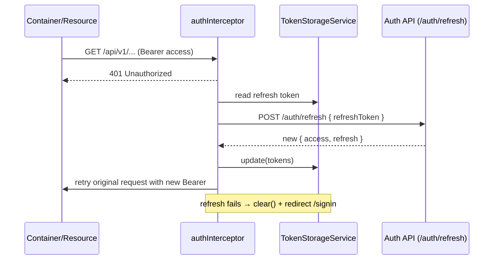

# Frontend architecture

This document gives the architecture of the frontend application (`apps/frontend`), an Angular SPA with Tailwind CSS styles,

## Overview

The application uses **feature folders** with layers: `domain` (the types), `infrastructure` (the data access and the browser persistence) and `ui` (the components plus the guards, the interceptors and the services of the feature). Around these features there is a shared application shell (`layout`), the route-level `pages`, and the `shared` code for all the features. A client-side JWT authentication with refresh-token rotation controls the access: there is one public sign-in route and one protected application shell.

---

## Stack

| Concern      | Tool                                                        |
|--------------|-------------------------------------------------------------|
| Framework    | Angular 22, standalone components, `bootstrapApplication` |
| Data access  | `@angular/common/http` — `httpResource` (reads) + `HttpClient` (mutations) |
| State        | Signals (`signal`, `computed`, `linkedSignal`, `input`/`output`) |
| Styling      | Tailwind CSS 4 (TailAdmin theme)                            |
| UI libraries | `@lucide/angular`, `@ng-select/ng-select` (wrapped, never used directly by callers) |
| Testing      | Vitest (`*.spec.ts`)                                        |

---

## Structure

### Bootstrap and routing

`main.ts` calls `bootstrapApplication(App, appConfig)`. `app.config.ts` registers:

```text
provideBrowserGlobalErrorListeners()
provideRouter(routes, withComponentInputBinding(), withInMemoryScrolling(…))
provideHttpClient(withInterceptors([authInterceptor]))
```

The root `App` is only a thin host. Its template is `<router-outlet /><app-toast />`. Thus the global toast overlay shows above each route. It injects `ThemeService` (which applies the stored theme at startup) and `Title`.

`app.routes.ts` gives **two tiers**. The first tier is a public `signin` route that `guestGuard` protects, and which sends an authenticated user to the dashboard. The second tier is the root `''` shell route that `authGuard` protects. This route loads `LayoutComponent` and loads each in-app page lazily as a child. A path that agrees with no route goes to the dashboard. The lazy children use `loadComponent`. If a feature has sub-pages, they are a nested `children` block below the path of the feature, and a deeper resource has more levels (for example, the services are below `projects/:id/services/…`, with a detail route with tabs and a redirect to a default tab). Each route sets a `title`.

### Per-feature layout

The three layers are always there in some form. A sub-folder is there only if the feature needs it. A simple feature has only `domain/models/` and `infrastructure/api/`. A large feature (for example, `authentication`) uses all the slots.

```text
features/<feature>/
  domain/
    models/         — domain model interfaces, <entity>.model.ts
    dtos/           — create/update/request payload interfaces
  infrastructure/
    api/            — API data access, <feature>-api.repository.ts
    storage/        — browser persistence (e.g. token storage)
  ui/
    containers/     — smart components: provide/inject the repository, own state, issue commands
    components/     — purely presentational (signal inputs/outputs, no injected services)
    guards/         — functional route guards (CanActivateFn)
    interceptors/   — functional HTTP interceptors (HttpInterceptorFn)
    services/       — root-provided services owning cross-screen feature state
```

Not all the features have a page. Some features give only components and a repository, which **a container of a different feature uses** on the screen of that other feature. For example, the service-detail screen uses child components and repositories from adjacent features, and these features have no route of their own. Other features have only models. Thus a feature gives the slots that it needs, and the screens are made by composition.

### Layout and pages

`layout/ui/{components,containers,services}/` holds the application shell. `LayoutComponent` is the wrapper of the root route. It shows the sidebar, the header and `<router-outlet>`. The header injects `AuthService` for the user menu and for the logout. `BreadcrumbComponent` (`app-breadcrumb`) is the standard page header. It takes a `pageTitle` signal input and shows a `Home › {{ pageTitle }}` trail. Each page puts it first.

`pages/` holds the route-level components, in a folder for each feature (`pages/<feature>/{list,add,edit,detail}/`). The class names end with `Page`, and the selectors are `app-<feature>-<action>-page`.

### Shared

```text
shared/
  components/   — reusable presentational primitives (one flat folder per component)
  services/     — cross-cutting root-provided services (e.g. the toast stack)
  pipes/        — reusable template pipes (e.g. safe-html for trusted markup)
```

The toast system is the reference cross-cutting service. `ToastService` (`providedIn: 'root'`) owns a stack that signals control, with typed `success`/`error`/`warning`/`info` helpers and an automatic dismissal. The presentational `ToastComponent` shows the stack. It is mounted one time, globally, in `App`.

---

## Conventions

### Layering

- **All the business logic stays in the feature**, and never in a page. Each screen is a smart container that injects the repository, holds the state signals, and sends the commands.
- **A page is thin.** It puts the components together, has no logic, and injects no services. Almost all the page classes are empty.
- **The route parameters come in through the page.** With `withComponentInputBinding()`, a routed page receives the route parameters as signal inputs with the same names (`:id` → `id`, `:serviceId` → `serviceId`) and sends them to its container as inputs. The container reads them with `input.required<string>()` and does not inject `ActivatedRoute`. Thus the container is independent of the routing, and a test can set the inputs.
- **The guards and the interceptors stay in `ui/`**, and not in `infrastructure/`, because they are concerns of the UI pipeline. The browser persistence (localStorage or sessionStorage) is a data concern and stays in `infrastructure/storage/`.

### API repositories

Each feature has one `@Injectable()` repository (`<feature>-api.repository.ts`). This repository owns all the HTTP access and makes its endpoints from `environment.apiBaseUrl`. Obey the [Angular `httpResource` guide](https://angular.dev/guide/http/http-resource): **a read uses `httpResource`, and a mutation uses `HttpClient`.**

- **A read** is a resource with `isLoading()`, `error()`, `hasValue()`, `value()`, `status()` and `reload()`. A read with an id parameter is a factory that returns a resource with an accessor as its key (`projectById(() => id)`). The resource stays idle until the accessor gives a value.
- **A mutation** (`create`/`update`/`delete`) is a thin method that returns an `Observable` with one emission. A container uses it with `lastValueFrom` and `async`/`await`, and never with a manual `subscribe`. Then the container calls `.reload()` on the applicable read resource. A long-lived stream with many emissions (for example, an SSE log stream) is the exception: the method returns an `Observable`, and the container subscribes to it and cancels the subscription itself.

A feature repository is **not** `providedIn: 'root'`. The smart container gives it (`providers: [ProjectsApiRepository]`). Thus each screen gets a new instance and a new fetch. Only the app-wide session concerns, such as the authentication, have a root-provided repository.

Reference: [`projects-api.repository.ts`](../apps/frontend/src/app/features/projects/infrastructure/api/projects-api.repository.ts).

### Containers

Each screen has one container. A list container reads a resource and controls the states in its own template (`@if (x.isLoading())` / `@else if (x.error())` / `@else if (x.hasValue())`, plus a branch for the empty condition). A command container owns a `submitting` signal, which it changes around the awaited call. It contains a presentational form, and it awaits the mutation in a `try/catch` block. If the mutation is successful, the container shows a toast and goes to a different route. A container that stays on the screen sets the flag again in `finally`. A container that goes to a different route can keep the flag set. A container can write to the `value` signal of a resource, to put a saved record into a detail view (`this.service.value.set(updated)`).

### Presentational components

A presentational component only shows data and emits events. It never injects a service. It uses **only signal inputs and signal outputs** (`input()`, `input.required()`, `output()`), and no `@Input()` decorators. A shared primitive also obeys these rules:

- The selector is `app-<name>`, the class name ends with `…Component`, and there is one flat folder `shared/components/<name>/<name>.component.{ts,html}`.
- **Do not use `CommonModule` or `ngClass`.** Make the dynamic classes with `[class]` bindings or with a `get …Classes()` accessor.
- **Extend the style with a `className` input**, which is added to the Tailwind classes of the component. Thus a caller can change the spacing and does not make a new component.
- Put a third-party widget behind the in-house contract (for example, the select control contains `@ng-select/ng-select`).

The Tailwind design tokens (`brand-*`, `error-*`, `success-*`, …) are defined in the `@theme` block of the global stylesheet. They come from TailAdmin.

### State

New state uses signals. The one recorded exception is `SidebarService` of the shell, which uses RxJS. It keeps the expanded, hovered and mobile-open state in a `BehaviorSubject`, and the templates read it with the `async` pipe. This is an intentional holdover from the TailAdmin port.

### Path aliases

`apps/frontend/tsconfig.json` gives an absolute import prefix to each top-level area. The routes, the pages, the containers and the components use these prefixes.

| Alias             | Path                       |
|-------------------|----------------------------|
| `@features/*`     | `./src/app/features/*`     |
| `@layout/*`       | `./src/app/layout/*`       |
| `@pages/*`        | `./src/app/pages/*`        |
| `@shared/*`       | `./src/app/shared/*`       |
| `@environments/*` | `./src/environments/*`     |

---

## Key flows

### Reads

```text
Route → LayoutComponent → Page → Container → <Feature>ApiRepository.<resource> (httpResource) → GET → backend
```

The container gives the resource to its template. The template shows the loading, error, value and empty branches from the signals of the resource.

### Commands

```text
Component (output) → Container → repository.create|update|delete (HttpClient) → backend
                                   → resource.reload() or router.navigate()
```

### Authentication

The `authentication` feature controls the access to all the application and uses each sub-layer:

| Piece                                        | Responsibility                                                                                                     |
|----------------------------------------------|--------------------------------------------------------------------------------------------------------------------|
| `infrastructure/api` — `AuthenticationApiRepository` (root) | `HttpClient` calls to the public auth endpoints: `login`, `refresh`, `logout`, `me`.                  |
| `infrastructure/storage` — `TokenStorageService` (root)     | The only owner of the token persistence: `localStorage` if "remember me" is set, and `sessionStorage` in the other cases. It gives the tokens as read-only signals, reads them at startup from the applicable storage, updates them after a rotation, and deletes them from the two storages at logout. |
| `ui/services` — `AuthService` (root)                        | The session state and the flows: the `isAuthenticated` computed value, the `currentUser` signal, `login`, `logout` and `loadCurrentUser`. It controls the repository, the storage and the router. |
| `ui/guards` — `authGuard` / `guestGuard`                    | `authGuard` protects the shell (it redirects to `/signin`). `guestGuard` protects the sign-in route (it redirects to `/dashboard`). The two guards read the token from the storage. |
| `ui/interceptors` — `authInterceptor`                       | It adds `Authorization: Bearer …` only to the requests to the backend API, and lets the `/auth/` traffic and the non-API traffic go through. After a `401`, it refreshes one time and sends the request again. |
| `ui/containers/signin`                                      | The smart sign-in container, which the public sign-in page contains.                                                          |


```mermaid
sequenceDiagram
    participant C as Container/Resource
    participant I as authInterceptor
    participant T as TokenStorageService
    participant A as Auth API (/auth/refresh)
    C->>I: GET /api/v1/... (Bearer access)
    I-->>C: 401 Unauthorized
    I->>T: read refresh token
    I->>A: POST /auth/refresh { refreshToken }
    A-->>I: new { access, refresh }
    I->>T: update(tokens)
    I->>C: retry original request with new Bearer
    Note over I,T: refresh fails → clear() + redirect /signin
```

---

## Operations

| Script  | Command                                        |
|---------|------------------------------------------------|
| `dev`   | `ng serve`                                     |
| `build` | `ng build`                                     |
| `watch` | `ng build --watch --configuration development` |
| `lint`  | `eslint .`                                     |
| `test`  | `ng test --watch=false`                        |

The API base URL comes **from the build** and is read from `src/environments/environment.ts`. For a development build, `angular.json` puts `environment.development.ts` in its place with `fileReplacements`. Thus each self-hosted deployment must set `apiBaseUrl` (with the `/api/v1` prefix) before the build.

---

## Related docs

- [Backend architecture](./backend-architecture.md)
- [Infrastructure architecture](./infrastructure-architecture.md)
- [Monorepo architecture](./monorepo-architecture.md)
