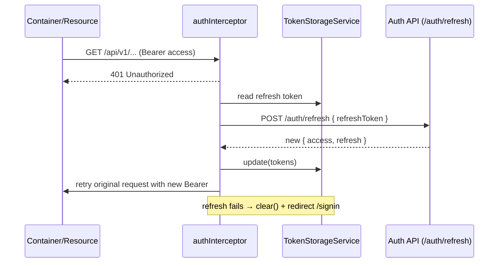

# Key flows

## Reads

```text
Route → LayoutComponent → Page → Container → <Feature>ApiRepository.<resource> (httpResource) → GET → backend
```

The container gives the resource to its template. The template shows the loading, error, value and empty branches from the signals of the resource.

## Commands

```text
Component (output) → Container → repository.create|update|delete (HttpClient) → backend
                                   → resource.reload() or router.navigate()
```

## Authentication

The `authentication` feature controls the access to all the application and uses each sub-layer:

| Piece                                        | Responsibility                                                                                                     |
|----------------------------------------------|--------------------------------------------------------------------------------------------------------------------|
| `infrastructure/api` — `AuthenticationApiRepository` (root) | `HttpClient` calls to the public auth endpoints: `login`, `refresh`, `logout`, `me`.                  |
| `infrastructure/storage` — `TokenStorageService` (root)     | The only owner of the token persistence: `localStorage` if "remember me" is set, and `sessionStorage` in the other cases. It gives the tokens as read-only signals, reads them at startup from the applicable storage, updates them after a rotation, and deletes them from the two storages at logout. |
| `ui/services` — `AuthService` (root)                        | The session state and the flows: the `isAuthenticated` computed value, the `currentUser` signal, `login`, `logout` and `loadCurrentUser`. It controls the repository, the storage and the router. |
| `ui/guards` — `authGuard` / `guestGuard`                    | `authGuard` protects the shell (it redirects to `/signin`). `guestGuard` protects the sign-in route (it redirects to `/dashboard`). The two guards read the token from the storage. |
| `ui/interceptors` — `authInterceptor`                       | It adds `Authorization: Bearer …` only to the requests to the backend API, and lets the `/auth/` traffic and the non-API traffic go through. After a `401`, it refreshes one time and sends the request again. |
| `ui/containers/signin`                                      | The smart sign-in container, which the public sign-in page contains.                                                          |


