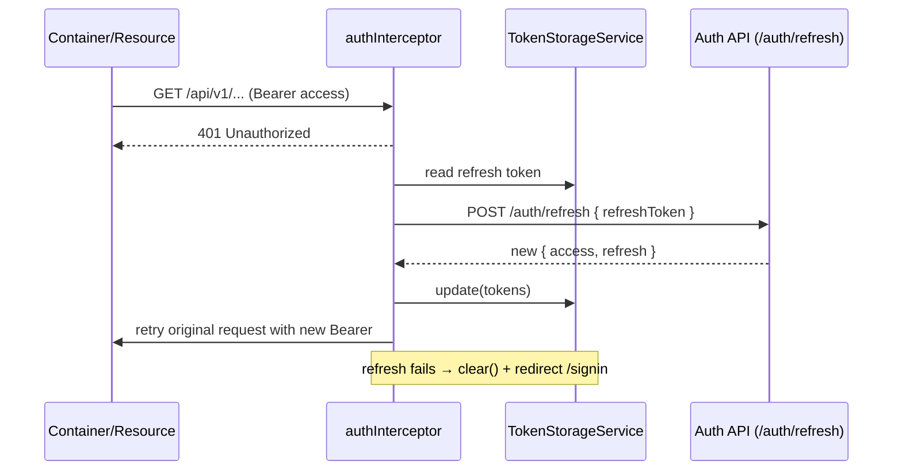

# Key flows

## Reads

```text
Route → LayoutComponent → Page → Container → <Feature>ApiRepository.<resource> (httpResource) → GET → backend
```

The container gives the resource to its template. The template shows the loading, error, value and empty branches from the signals of the resource.

## Commands

```text
Component (output) → Container → repository.create|update|delete (HttpClient) → backend
                                   → resource.reload() or router.navigate()
```

## Authentication

The `authentication` feature controls the access to all the application and uses each sub-layer:

| Piece                                        | Responsibility                                                                                                     |
|----------------------------------------------|--------------------------------------------------------------------------------------------------------------------|
| `infrastructure/api` — `AuthenticationApiRepository` (root) | `HttpClient` calls to the public auth endpoints: `login`, `refresh`, `logout`, `me`.                  |
| `infrastructure/storage` — `TokenStorageService` (root)     | The only owner of the token persistence: `localStorage` if "remember me" is set, and `sessionStorage` in the other cases. It gives the tokens as read-only signals, reads them at startup from the applicable storage, updates them after a rotation, and deletes them from the two storages at logout. |
| `ui/services` — `AuthService` (root)                        | The session state and the flows: the `isAuthenticated` computed value, the `currentUser` signal, `login`, `logout` and `loadCurrentUser`. It controls the repository, the storage and the router. |
| `ui/guards` — `authGuard` / `guestGuard`                    | `authGuard` protects the shell (it redirects to `/signin`). `guestGuard` protects the sign-in route (it redirects to `/dashboard`). The two guards read the token from the storage. |
| `ui/interceptors` — `authInterceptor`                       | It adds `Authorization: Bearer …` only to the requests to the backend API, and lets the `/auth/` traffic and the non-API traffic go through. After a `401`, it refreshes one time and sends the request again. |
| `ui/containers/signin`                                      | The smart sign-in container, which the public sign-in page contains.                                                          |



## Error handling

The backend answers every failed request with one JSON envelope, and its `code` field, not its HTTP status, tells the client what went wrong. `readErrorPayloadUseCase` reads an `HttpErrorResponse` and gives back its status, its parsed `code` and its raw body; it checks the body against `errorEnvelopeSchema.pick({ code: true })` of `@gitpaas/contracts` before it trusts the field, so a body that carries no envelope gives a `null` code instead of a wrong read.

## Providers

The `providers` feature manages the accounts a service reaches its source code through (today, one GitHub App
for each provider). It follows the standard read/command flows above, with the screens under
`pages/providers/{list,add,edit,registrations/{created,installed}}/` and their containers under `features/providers/ui/containers/`:

| Screen                       | Route                              | Container                                 | Responsibility                                                                                       |
|-------------------------------|-------------------------------------|--------------------------------------------|---------------------------------------------------------------------------------------------------------|
| List                          | `/providers`                        | `ProvidersListComponent`                   | Reads the `providers` resource of `ProvidersApiRepository`, shows one `ProviderCardComponent` for each provider, tests a connection on demand, and confirms a deletion with `ConfirmModalComponent`. |
| Add                           | `/providers/add`                    | `ProviderAddComponent` / `ProviderRegistrationStartComponent` | Offers two paths with `ProviderPathChoiceComponent`, and shows no field before the user chooses one. The manual path wraps `ProviderFormComponent`, unchanged. The App-of-GitPaaS path asks the name and the owner, then submits GitHub's manifest (see below). |
| Return (creation)             | `/providers/registrations/created`  | `ProviderRegistrationCreatedComponent`     | Reads `code` and `state` from the query, converts the App, and sends the browser to GitHub's installation screen. |
| Return (installation)         | `/providers/registrations/installed`| `ProviderRegistrationInstalledComponent`   | Reads `installation_id` and `state`, ends the registration, and navigates to `/providers`. |
| Edit                          | `/providers/edit/:id`               | `ProviderEditComponent`                    | Loads one provider by id, wraps the same `ProviderFormComponent` with `keyOptional` set, and sends only the changed fields. |

The API never gives the private key back, only its fingerprint (see [Domain model](../backend-business/domain-model.md#the-provider)). Because of this, the private-key field of `ProviderFormComponent` always starts empty, and the two containers treat an empty submission differently: `ProviderAddComponent` requires a key, and `ProviderEditComponent` omits the `privateKey` field of its `UpdateProviderDto` when the field stays empty, so the backend keeps the stored key.

The list container also drives the "test connection" action: it calls `POST /providers/:id/test` through the repository and keeps the outcome (`idle` / `testing` / `success` / `failure` / `incomplete`) in a local signal keyed by the provider id, so each card shows its own state without a full reload of the list. The state `incomplete` matches the backend outcome of the same name: the card shows a warning, and names each permission the App still lacks.

### Registering an App from a manifest

The path "App of GitPaaS" calls `POST /providers/registrations` and gets back the manifest GitPaaS wrote and the address of GitHub. `submitProviderManifest` (`features/providers/infrastructure/github/`) builds a hidden form whose one field is the manifest and whose `action` is that address, and submits it with a top-level navigation — the way GitHub's manifest flow expects.

GitHub then sends the browser back to the frontend directly, never to the backend, because that navigation carries no token and every endpoint stays behind the guard of the roles. The two return screens each check `AuthService.isAuthenticated()` first, and send an unauthenticated user to `/signin` with a `returnUrl` that resumes the flow. On success, the creation screen opens GitHub's installation screen with `openProviderInstallation`; the installation screen shows a toast and returns to `/providers`. On failure, both screens show `ProviderRegistrationFailureComponent`, which names the step that failed, states that the App may already exist on GitHub, and links back to `/providers`.

The tab "Provider" of a service detail page (`features/services/ui/components/service-provider/`) is a
consumer of this feature rather than a screen of it: its first field is a select of the registered providers,
and the controls of the repository and of the branch stay blocked, and clear on a change of provider, until a
provider is chosen. That component calls `GET /providers/:providerId/repositories` and
`GET /providers/:providerId/repositories/:repositoryId/branches` through `ProvidersApiRepository`, and it
shows an empty state with a link to `/providers/add` when no provider is registered yet.
